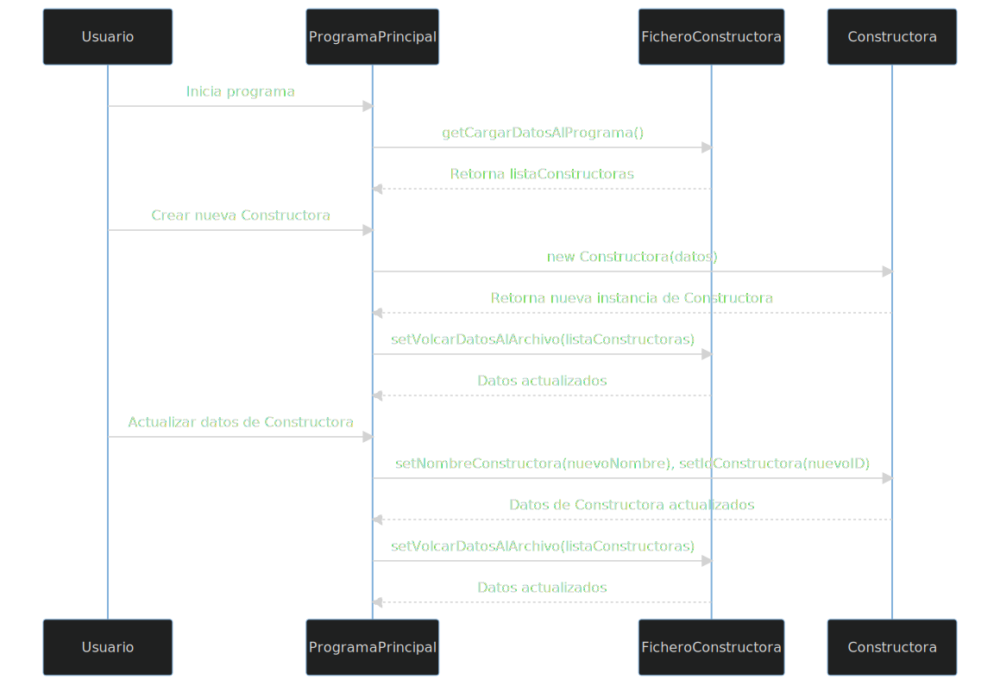

## Trabajo Final del Primer Bimestre - Programación Orientada a Objetos

### Consideraciones Generales

- El trabajo es grupal.
- Se debe generar una solución en UML y lenguaje de programación en Java.
- Se ha creado un proyecto de Netbeans, en el cual existen creados paquetes y clases; con base al proyecto seguir con el desarrollo de la solución.
- Usted debe adicionar las clases que sean necesarias.
- Las clases deben tener los métodos respectivos por cada atributo.
- Es importante usar métodos constructores en las clases.
- Usted debe crear una carpeta donde se ubican los diagramas de las clases.

### Problemática

Se necesita realizar un sistema de gestión de una inmobiliaria. En la empresa se necesita llevar el registro de constructoras, edificios, departamentos, casas

A continuación se definen algunas particularidades.
* Una casa tiene propiedades como: propietario (nombres, apellidos, identificación; precio por metro cuadrado; número de metros cuadrados; costo final; barrio (nombre del barrio, referencia); ciudad (nombre ciudad, nombre provincia); numero de cuartos; constructora (nombre constructora, id de la empresa)

* Por cada departamento se necesita: propietario (nombres, apellidos, identificación); precio por metro cuadrado; número de metros cuadrados; valor alícuota mensual; costo final; barrio (nombre del barrio, referencia); ciudad (nombre ciudad, nombre provincia); nombre de edificio; ubicación del departamento en edificio; constructora (nombre constructora, id de la empresa)

El sistema debe permitir ingresar: propietarios; barrio; ciudades; constructoras; casas; departamentos. Además se solicita considerar lo siguiente:

* Todos los objetos de tipo propietario se deben ingresar y guardar en un archivo llamado propietarios.dat
* Todos los objetos de tipo barrio se deben ingresar y guardar en un archivo llamado barrios.dat
* Todos los objetos de tipo ciudad se deben ingresar y guardar en un archivo llamado ciudades.dat
* Todos los objetos de tipo constructora se deben ingresar y guardar en un archivo llamado constructoras.dat
* Todos los objetos de tipo casa se deben ingresar y guardar en un archivo llamado casas.dat
* Para el ingreso de una casa se debe tomar en consideración el siguiente proceso:
	* El propietario se debe obtener del archivo propietarios.dat a través de la identificación.
	* El barrio se debe obtener del archivo barrio.dat a través del nombre del barrio.
	* La ciudad se debe obtener del archivo ciudades.dat a través del nombre de la ciudad.
	* La constructora se debe obtener del archivo constructoras.dat a través del id de la empresa.
	* El costo final es igual al número de metros * precio del metro cuadrado.

* Todos los objetos de tipo departamento se deben ingresar y guardar en un archivo llamado departamentos.dat
* Para el ingreso de un departamento se debe tomar en consideración lo siguiente:
	* El propietario se debe obtener del archivo propietarios.dat a través de la identificación.
	* El barrio se debe obtener del archivo barrio.dat a través del nombre del barrio.
	* La ciudad se debe obtener del archivo ciudades.dat a través del nombre de la ciudad.
	* La constructora se debe obtener del archivo constructoras.dat a través del id de la empresa.
	* El costo final es igual al (número de metros * valor del metro cuadrado) + (valor alícuota mensual * 12).

* Debe existir la posibilidad de listar los datos ingresados para:
	* Propietarios
	* Barrios
	* Ciudades
	* Constructoras
	* Casas
	* Departamentos

### Herramientas a usar

- Lenguaje de programación Java
- Diagramador - DIAUML
- Git
- Github / GitHub-classroom

### Fecha de presentación

- Semana 8 del primer bimestre

## Requerimientos funcionales
Se agrupan los requerimientos para facilitar el desarrollo del trabajo.

| ID   | Requerimiento Funcional                | Descripción                                                                                                                                                                                                                                                                                                                                                          | Completado |
|------|----------------------------------------|----------------------------------------------------------------------------------------------------------------------------------------------------------------------------------------------------------------------------------------------------------------------------------------------------------------------------------------------------------------------|------------|
| RF01 | Creación de Proyecto en Netbeans       | Crear un proyecto en Netbeans en Java con paquetes y clases definidas.                                                                                                                                                                                                                                                                                               | [ ]        |
| RF02 | Adición de Clases                      | Se debe tener la capacidad de adicionar las clases que sean necesarias en el proyecto.                                                                                                                                                                                                                                                                               | [ ]        |
| RF03 | Generación de Métodos                  | Todas las clases deben tener métodos correspondientes para cada atributo.                                                                                                                                                                                                                                                                                            | [ ]        |
| RF04 | Implementación de Constructores        | Se deben usar métodos constructores en las clases.                                                                                                                                                                                                                                                                                                                   | [ ]        |
| RF05 | Creación de Carpeta de Diagramas       | Crear una carpeta donde se ubican los diagramas de las clases.                                                                                                                                                                                                                                                                                                       | [ ]        |
| RF06 | Registro de Propietarios               | El sistema debe permitir registrar los detalles de los propietarios y guardarlos en un archivo llamado propietarios.dat.                                                                                                                                                                                                                                             | [ ]        |
| RF07 | Registro de Barrios                    | El sistema debe permitir registrar los detalles de los barrios y guardarlos en un archivo llamado barrios.dat.                                                                                                                                                                                                                                                       | [ ]        |
| RF08 | Registro de Ciudades                   | El sistema debe permitir registrar los detalles de las ciudades y guardarlos en un archivo llamado ciudades.dat.                                                                                                                                                                                                                                                     | [ ]        |
| RF09 | Registro de Constructoras              | El sistema debe permitir registrar los detalles de las constructoras y guardarlos en un archivo llamado constructoras.dat.                                                                                                                                                                                                                                           | [ ]        |
| RF10 | Registro de Casas                      | El sistema debe permitir registrar los detalles de las casas y guardarlos en un archivo llamado casas.dat. Los detalles requeridos incluyen: propietario, precio por metro cuadrado, número de metros cuadrados, costo final, barrio, ciudad, número de cuartos y constructora.                                                                                      | [ ]        |
| RF11 | Registro de Departamentos              | El sistema debe permitir registrar los detalles de los departamentos y guardarlos en un archivo llamado departamentos.dat. Los detalles requeridos incluyen: propietario, precio por metro cuadrado, número de metros cuadrados, valor alícuota mensual, costo final, barrio, ciudad, nombre del edificio, ubicación del departamento en el edificio y constructora. | [ ]        |
| RF12 | Cálculo de Costo Final de Casa         | Para el ingreso de una casa, el costo final es igual al número de metros multiplicado por el precio del metro cuadrado.                                                                                                                                                                                                                                              | [ ]        |
| RF13 | Cálculo de Costo Final de Departamento | Para el ingreso de un departamento, el costo final es igual a (número de metros * valor del metro cuadrado) + (valor alícuota mensual * 12).                                                                                                                                                                                                                         | [ ]        |
| RF14 | Listar Propietarios                    | Debe existir la posibilidad de listar los datos ingresados de los propietarios.                                                                                                                                                                                                                                                                                      | [ ]        |
| RF15 | Listar Barrios                         | Debe existir la posibilidad de listar los datos ingresados de los barrios.                                                                                                                                                                                                                                                                                           | [ ]        |
| RF16 | Listar Ciudades                        | Debe existir la posibilidad de listar los datos ingresados de las ciudades.                                                                                                                                                                                                                                                                                          | [ ]        |
| RF17 | Listar Constructoras                   | Debe existir la posibilidad de listar los datos ingresados de las constructoras.                                                                                                                                                                                                                                                                                     | [ ]        |
| RF18 | Listar Casas                           | Debe existir la posibilidad de listar los datos ingresados de las casas.                                                                                                                                                                                                                                                                                             | [ ]        |
| RF19 | Listar Departamentos                   | Debe existir la posibilidad de listar los datos ingresados de los departamentos.                                                                                                                                                                                                                                                                                     | [ ]        |

## Diagramas

### Diagrama UML

## Diagrama de secuencia
Flujo de diagrama de secuencia para Constructora

## Diagrama de casos de uso

## Diagrama de actividades

### Funcionalidades ya probadas

| CRUD                 | Crea | Read | Update | Delete | Cargar | Guardar |
|----------------------|------|------|--------|--------|--------|---------|
| Propietario (Daniel) | [x]  | [x]  | [x]    | [x]    | [x]    | [x]     |
| Barrio (Alex)        | [x]  | [x]  | [x]    | [x]    | [x]    | [x]     |
| Ciudad (Raul)        | [x]  | [x]  | [x]    | [x]    | [x]    | [x]     |
| Constructora ()      | [x]  | [x]  | [x]    | [x]    | [x]    | [x]     |
| Casa (José)          | [x]  | [x]  | [x]    | [x]    | [x]    | [x]     |
| Dapartamento (Diego) | [x]  | [x]  | [x]    | [x]    | [x]    | [x]     |

Cargar hacer referencia a la lectura de los archivos .dat y guardar a la escritura de los mismos y Guardar a la escritura de los mismos.